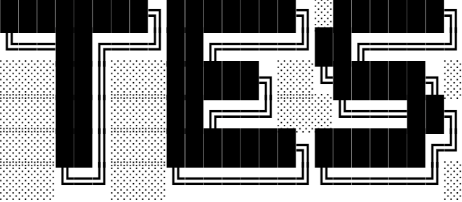

<p align="center">
  
</p>

# Tes Lang

Tes is dynamically typed interpreted object oriented programming language written in typescript

## Parser

Recursive Descent Parser

## Grammar

### Lexical Grammar

```
NUMBER         → DIGIT+ ( "." DIGIT+ )? ;
STRING         → "\"" <any char except "\"">* "\"" ;
IDENTIFIER     → ALPHA ( ALPHA | DIGIT )* ;
ALPHA          → "a" ... "z" | "A" ... "Z" | "_" ;
DIGIT          → "0" ... "9" ;
```

### Parser Grammar

```
program → declaration* EOF ;
declaration    → classDecl | funDecl | varDecl | statement ;
classDecl      → "class" IDENTIFIER ( "<" IDENTIFIER )? "{" function* "}" ;
funDecl        → "fun" function ;
varDecl        → "var" IDENTIFIER ( "=" expression )? ";" ;

statement      → exprStmt | forStmt | ifStmt | printStmt | breakStmt | continueStmt | returnStmt | whileStmt | block ;
exprStmt       → expression ";" ;
forStmt        → "for" "(" ( varDecl | exprStmt | ";" ) expression? ";" expression? ")" statement ;
ifStmt         → "if" "(" expression ")" statement ( "else" statement )? ;
printStmt      → "print" expression ";" ;
breakStmt      → "break ;"
continueStmt   → "continue ;"
returnStmt     → "return" expression? ";" ;
whileStmt      → "while" "(" expression ")" statement ;
block          → "{" declaration* "}" ;

expression     → assignment ;
assignment     → ( call "." )? IDENTIFIER "=" assignment | logic_or ;
logic_or       → logic_and ( "or" logic_and )* ;
logic_and      → equality ( "and" equality )* ;
equality       → comparison ( ( "!=" | "==" ) comparison )* ;
comparison     → term ( ( ">" | ">=" | "<" | "<=" ) term )* ;
term           → factor ( ( "-" | "+" ) factor )* ;
factor         → unary ( ( "/" | "*" ) unary )* ;

unary          → ( "!" | "-" ) unary | call ;
call           → primary ( "(" arguments? ")" | "." IDENTIFIER )* ;
primary        → "true" | "false" | "nil" | "this" | NUMBER | STRING | IDENTIFIER | "(" expression ")"
               | "super" "." IDENTIFIER ;

function       → IDENTIFIER "(" parameters? ")" statement ;
parameters     → IDENTIFIER ( "," IDENTIFIER )* ;
arguments      → expression ( "," expression )* ;
```
